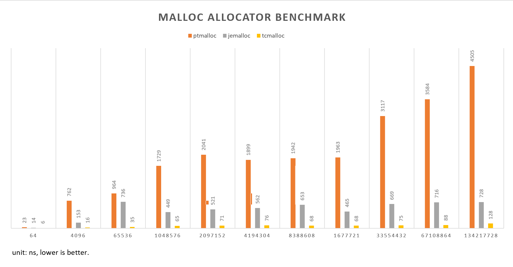

# Heap Allocation Analysis Lab

This lab to analyze the heap memory usage of the `heap_alloc` program and 
evaluate the performance of different memory allocators, 
namely ptmalloc2, jemalloc, and tcmalloc.

## analyze the heap memory usage of the `heap_alloc` program
```
--------------------------------------------------------------------------------
Command:            ./heap_alloc
Massif arguments:   --massif-out-file=massif.out --depth=1
ms_print arguments: massif.out
--------------------------------------------------------------------------------


    KB
530.8^                                                              #
     |                                                             :#:
     |                                                            ::#:
     |                                                           @::#:
     |                                                         ::@::#::
     |                                                        :::@::#::
     |                                                      :@:::@::#::
     |                                                     ::@:::@::#:::
     |                                                    @::@:::@::#:::
     |                                                  ::@::@:::@::#::::
     |                                                 :::@::@:::@::#:::@
     |                                                ::::@::@:::@::#:::@
     |                                              ::::::@::@:::@::#:::@:
     |                                             :@:::::@::@:::@::#:::@:
     |                                            @:@:::::@::@:::@::#:::@::
     |                                           :@:@:::::@::@:::@::#:::@::
     |                                         :@:@:@:::::@::@:::@::#:::@:::
     |                                        ::@:@:@:::::@::@:::@::#:::@:::
     |                                      ::::@:@:@:::::@::@:::@::#:::@:::
     |                                     :::::@:@:@:::::@::@:::@::#:::@:::@
   0 +----------------------------------------------------------------------->ki
     0                                                                   312.2

Number of snapshots: 90
 Detailed snapshots: [16, 21, 26, 40, 49, 59, 67 (peak), 77, 87]
-------------------------------------------------------------------------------
  n        time(i)         total(B)   useful-heap(B) extra-heap(B)    stacks(B)
-------------------------------------------------------------------------------
 67        278,275          543,536          528,153        15,383            0
```
## evaluate the performance of different memory allocators

### ptmalloc2

```
● ./bench-ptmalloc 543536
{
 "timing_type": "clock_gettime",
 "functions": {
  "malloc": {
   "": {
    "malloc_block_size": 543536,
    "max_rss": 8196,
    "main_arena_st_allocs_0025_time": 1280.04,
    "main_arena_st_allocs_0100_time": 1236.56,
    "main_arena_st_allocs_0400_time": 1382.58,
    "main_arena_st_allocs_1600_time": 1640.1,
    "main_arena_mt_allocs_0025_time": 1278.21,
    "main_arena_mt_allocs_0100_time": 1231.35,
    "main_arena_mt_allocs_0400_time": 1375.84,
    "main_arena_mt_allocs_1600_time": 1585.47,
    "thread_arena__allocs_0025_time": 847.16,
    "thread_arena__allocs_0100_time": 831.227,
    "thread_arena__allocs_0400_time": 1327.53,
    "thread_arena__allocs_1600_time": 1734.35
   }
  }
 }
}
```

### jemalloc

```
● ./bench-jemalloc 543536
{
 "timing_type": "clock_gettime",
 "functions": {
  "malloc": {
   "": {
    "malloc_block_size": 543536,
    "max_rss": 9164,
    "main_arena_st_allocs_0025_time": 328.481,
    "main_arena_st_allocs_0100_time": 326.804,
    "main_arena_st_allocs_0400_time": 398.394,
    "main_arena_st_allocs_1600_time": 407.698,
    "main_arena_mt_allocs_0025_time": 321.386,
    "main_arena_mt_allocs_0100_time": 369.219,
    "main_arena_mt_allocs_0400_time": 421.747,
    "main_arena_mt_allocs_1600_time": 424.258,
    "thread_arena__allocs_0025_time": 288.789,
    "thread_arena__allocs_0100_time": 345.589,
    "thread_arena__allocs_0400_time": 399.361,
    "thread_arena__allocs_1600_time": 424.364
   }
  }
 }
}
```
### tcmalloc

```
● ./bench-tcmalloc 543536
{
 "timing_type": "clock_gettime",
 "functions": {
  "malloc": {
   "": {
    "malloc_block_size": 543536,
    "max_rss": 7920,
    "main_arena_st_allocs_0025_time": 95.9681,
    "main_arena_st_allocs_0100_time": 95.6046,
    "main_arena_st_allocs_0400_time": 99.6608,
    "main_arena_st_allocs_1600_time": 101.449,
    "main_arena_mt_allocs_0025_time": 96.359,
    "main_arena_mt_allocs_0100_time": 95.0709,
    "main_arena_mt_allocs_0400_time": 98.4282,
    "main_arena_mt_allocs_1600_time": 97.3089,
    "thread_arena__allocs_0025_time": 98.9986,
    "thread_arena__allocs_0100_time": 101.711,
    "thread_arena__allocs_0400_time": 99.6496,
    "thread_arena__allocs_1600_time": 99.6766
   }
  }
 }
}
```

### Bar chart


